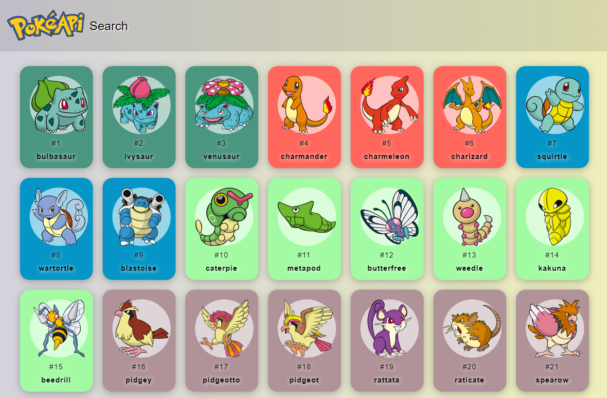

# Pokedex

An app to see the pokemons information using [Poke api](https://pokeapi.co/)



### Built With 🛠️


* [React.js](https://es.reactjs.org/) 
* [css](https://sass-lang.com/)
* [poke api](https://pokeapi.co/)


## Live demo 🔴

Sitio Web - [pokedex](https://diegorodriguez-sc.github.io/pokedex/).


## Getting Started 🚀

This is an example of how you may give instructions on setting up your project locally.
To get a local copy up and running follow these simple example steps.

### Installation

1. Clone the repo
   ```sh
   git clone https://github.com/DiegoRodriguez-sc/pokedex.git
   ```
2. Install NPM packages
   ```sh
   npm install
   ```
3. Run `Pokedex`
   ```sh
   npm start
   ```


## Contact ☎️

 * [Linkedin](www.linkedin.com/in/diego-rodriguez-sc)

* Project Link: [https://github.com/DiegoRodriguez-sc/pokedex](https://github.com/DiegoRodriguez-sc/pokedex)

